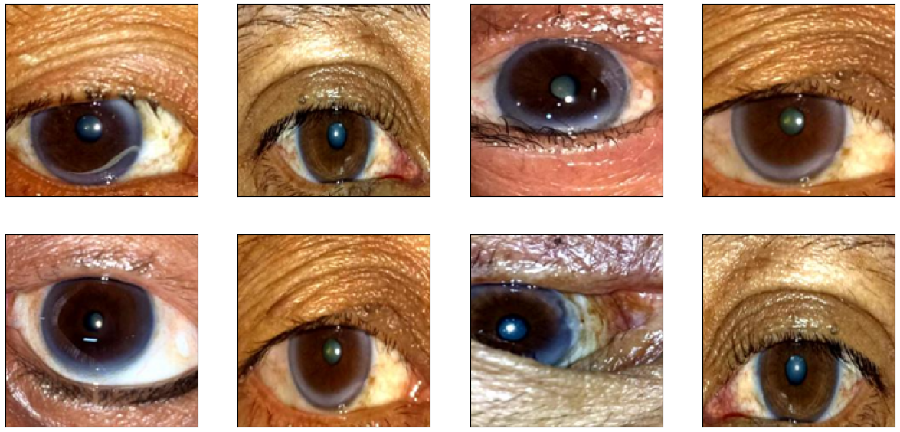

# Proyecto: `Clasificacion de cataratas en imagenes oculares.`

* **Integrantes**
    * Luigi Orlando Garcia Duarte
    * Juan Jose Rincon
    * Juan Pablo Arias

* **Curso**
    * Inteligencia Arificial II

* **Grupo**
    * F1

* **Profesor**
    * Willian romero

## Introduccion

1. **Cataratas**

    * Las Cataratas son una condicción ocular en la que el cristalino (La lente natural del ojo se vuelve opaco, lo que dificulta la visión). El cristalino normalmente se transparenta y permite que la luz pase a la retina, pero cuando se desarrolla catarata, la visión puede volverse borrosa o nublada.

2. **Causas**
    * Las causas gerealmente se desarrollan como parte del proceso de envejecimiento natural, pero también puede aparecer debido a:
        * **Envejecimiento**
        * **Exposicion prolongada a la luz ultravioleta**
        * **Uso prolongado de medicamenteos esteroides**
        * **Lesion o traumatismos oculares**
        * **Diabetes**
        * **Tabaquismo**
        * **Factores genéticos**
    
3. **Características**
    * Los síntomas de las cataratas suele desarrollarse gradualmente, e incluyen:
        * **Vision borrosa o nublada**
        * **Colores desviados o amarillentos**
        * **Dificultada para ver en la noche**
        * **Sensibilidad a la luz**
        * **Aparacíon de halos alrededor de las luces**
        * **Visión doble en un ojo**

4. **Tratamientos**
    * El unico tratamiento definitivo a las cataratas es la **cirugia**, ya que no hay medicamentos o gotas que pueden eliminar la opacidad del critalino.
    * **Tipos de Cirugías:**

        1. **Facoemulsificación**

            * Funcionamiento:Se usa ultrasonido para romper la catarata, y los fragmentos se aspiran fuera del ojo. Después, se inserta una lente intraocular (LIO) en el lugar del cristalino dañado.
            * Ideal para: pacientes con cataratas que no están muy avanzadas, cuando el cristalino aun no esta extremadamente endurecido.
            * Requerimientos: La catarata debe ser lo suficiente blanda para que el ultrasonido pueda romperla sin complicaciones. Adecuado para pacientes con pupilas que pueden dilatarse bien durante cirugía.

        2. **Extracción extracapsular**

            * Funcionamiento: Cosiste en remover manualmente la parte opaca del cristalino. Requiere una incisión mas grande.
            * Ideal para: Cataratas mas duras y avanzadas, cuando el cristalino se ha vuelto muy denso. Casos en los que la facoemulsificación no seria efectiva.
            * Requerimientos: EL cristalino esta muy endurecido y no puede ser roto fácilmente por el ultrasonido.

        3. **Cirugía láser de cataratas**
            
            * Funcionamiento: Se utiliza un láser para hacer las incisiones en el ojo y fragmentar el cristalino antes de aspirarlo. A veces se considera una opción mas precisa y puede facilitar una recuperación mas rápida.
            * Ideal para: Personas que prefieren un procedimiento mas preciso o aquellos que tiene alguna deformidad en el ojo que podría hacer mas complicada una cirugía manual.
            * Requerimientos: Debe haber una evaluación completa para determinar si el paciente es candidato para la cirugía liases. ya que no todas los casos de cataratas se benefician del uso del láser.

## Justificación

* Como pudimos ver las cataratas son complejas y su única forma de tratamiento definitivo disponible es por medio de cirugía,existen varias de estas las cuales depende de requerimientos para poder realizarlas, Es decir no todas las cataratas se pueden tratar con el mismo método por lo cual requiere un análisis exhaustivo por el personal calificado para determinar si es necesario que el paciente se realiza una cirugía y que tipo de cirugía. Siendo esto un proceso largo el cual podría acortarse con el uso de la tecnología agilizando el proceso para el personal calificado donde ya tengan cierta parte del trabajo tedioso hecho y pueda concentrarse solo en la realización de diagnósticos en pacientes previamente clasificados.

## Objetivos y Alcance

1. **Objetivos del proyecto:**

    * Desarrollar un modelo de inteligencia artificial (IA): Crear un modelo de deep learning que, mediante imágenes oculares, sea capaz de identificar la presencia de cataratas
    * Clasificación del Grado de cataratas: EL modelo debe poder clasificar las cataratas en diferentes grados (normal (sin parecencia de cataratas), iniciales , avanzadas)
    * Comparación de modelo CNN Y DNN: Buscaremos comparar el desarrollo de los dos anteriores objetivos utilizando dos diferentes tipos de redes neuronales CNN y DNN y buscaremos determinar cual fue mas precisa , eficiente ventajas y desventajas de su uso para este caso.
    * Recomendación de tipo de Cirugía: Con base en las predicción determinada por el modelo definiremos si el paciente debe o no tener cirugía y que tipo de cirugías podría ser aplicables.Alcances del proyecto:
    * Reducir el tiempo de diagnostico: Automatizar el proceso de diagnostico mediante el uso de imágenes oculares para acelerar el tiempo de evaluación y determinación de la necesidad de cirugía.
    * Accesibilidad de tratamiento: La automatización de diagnostico puede permitir la detección de esta afección en sonaos rurales donde es difícil encontrar especialistas.
    * Mayor precisión en el diagnostico: Al automatizar ciertos aspectos del diagnostico permite al personal calificado tener mayor tiempo y claridad para la definición de un diagnostico final.
    * Integración con sistemas de diagnóstico clínico: El modelo puede integrarse con plataformas hospitalarias o clínicas para facilitar la interpretación médica y la recomendación de tratamientos.

## Dataset

*  El dataset contiene imagenes oculares divididos en tres directorios en (`train`, `test` y `validacion`) las cuales contiene subdirectorios divididos en tres categorias:
    * **Immature** 
    * **Mature**
    * **Normal**

## Images

## Tamaño del Dataset

* **train**
    * Contiene 1753 imagenes con tamaño de 150px x 150px.
* **valid**
    * Contiene 760 imagenes con tamaño de 150px x 150px.
* **test**
    * Contiene 714 imagenes con tamaño de 150px x 150px.

